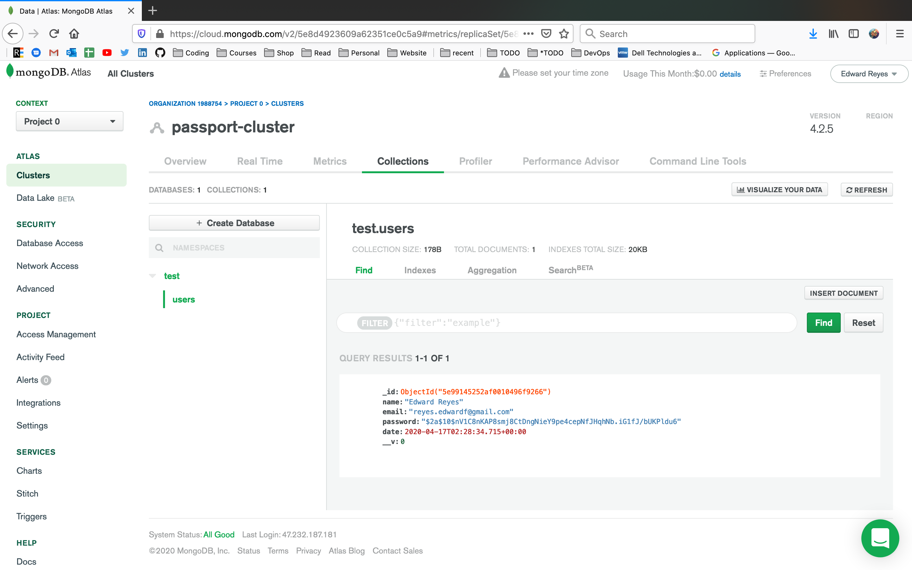
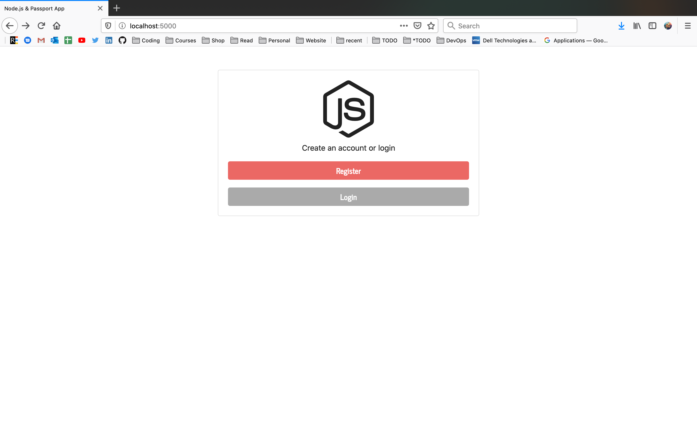
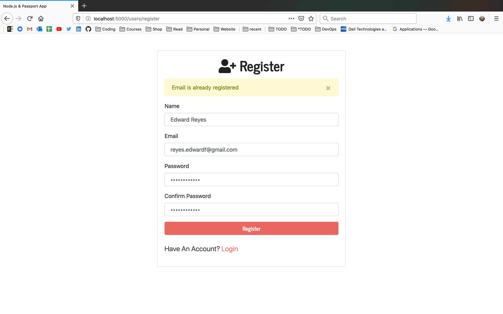
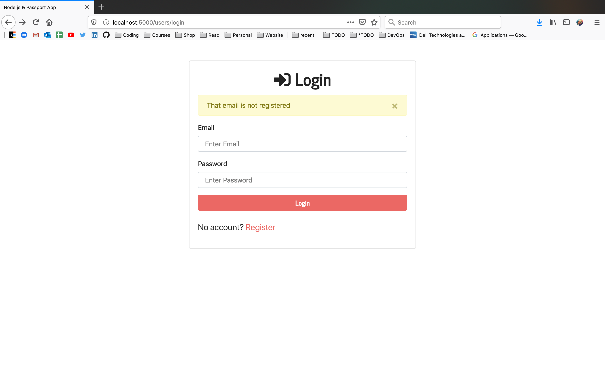
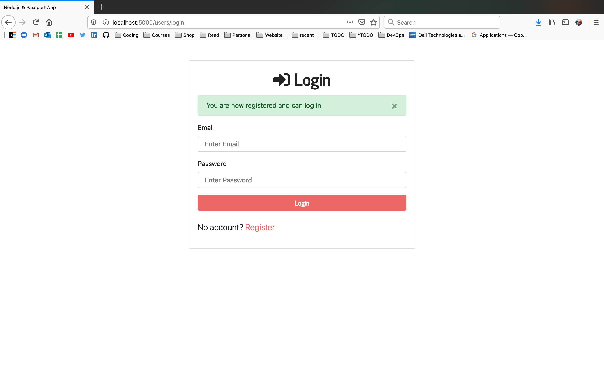

# Node.js & Passport Login

This is a user login and registration app using Node.js, Express, Passport, Mongoose, EJS and some other packages.

### Usage

```sh
$ npm install
```

```sh
$ npm start
# Or run with Nodemon
$ npm run dev

# Visit http://localhost:5000
```

### MongoDB

Open "config/keys.js" and add your MongoDB URI, local or Atlas



# Features
### Welcome page

### Register Validation

### Login Authorization




